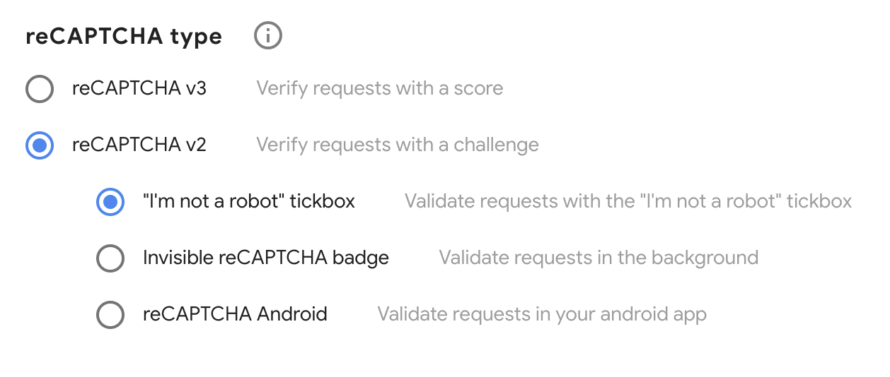

# reCAPTCHA

A Google reCAPTCHA library design for native Objective-C. <br/>
This library automatically handles reCAPTCHA's events and retrieves the validation token.

## Preview


## Reminder
Beware that this library only works for ReCaptcha v2 "I'm not a robot" tickbox. <br/>
Make sure to check the reCAPTCHA v2 "I'm not a robot" tickbox option when creating your API Key. <br/>


## Setup
You need to import the library from RecaptchaViewController.h:
```
#import "RecaptchaViewController.h"
```

Present it on your view controller as overlay:
```
ReCaptchaViewController *vc = [ReCaptchaViewController new];
vc.delegate = self;
NSString *locale = @"en"; // YOUR LOCALE
NSString *siteKey = @"YOUR SITE KEY";
vc.modalPresentationStyle = UIModalPresentationOverFullScreen;
[self presentViewController:vc animated:false completion:nil];
[vc loadCaptchaWithSiteKey:siteKey Locale:locale];
```

With validation response delegate:
```
@interface ExampleViewController : UIViewController<RobotCheckResponseDelegate>
```

```
#pragma mark - robot check delegate

- (void)captchaValidateSuccess:(NSString *)token {
    NSLog(@"Your token : %@", token);
}

- (void)captchaDidExpire {
    NSLog(@"token expired");
}

- (void)exitCaptchaView {
    [self dismissViewControllerAnimated:false completion:^{
        NSLog(@"exit robot check page");
    }];
}

```

## Requirements
iOS 9.0 or above <br/>
Support Swift 5.0

## Installation
reCAPTCHA-OC is available through CocoaPods. To install it, simply add the following line to your Podfile:

```
pod 'reCAPTCHA-OC'
```

## Author
Mr. Kam Chun Kit

## License
reCAPTCHA-OC is available under the MIT license. See the LICENSE file for more info.